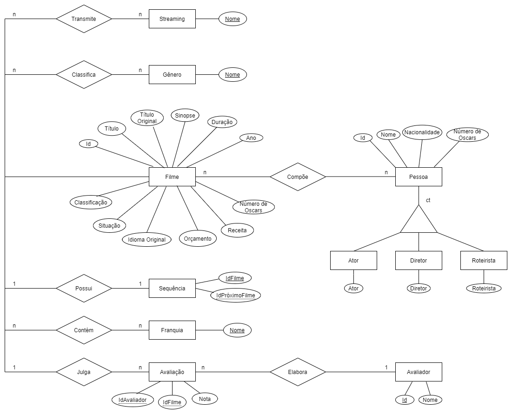
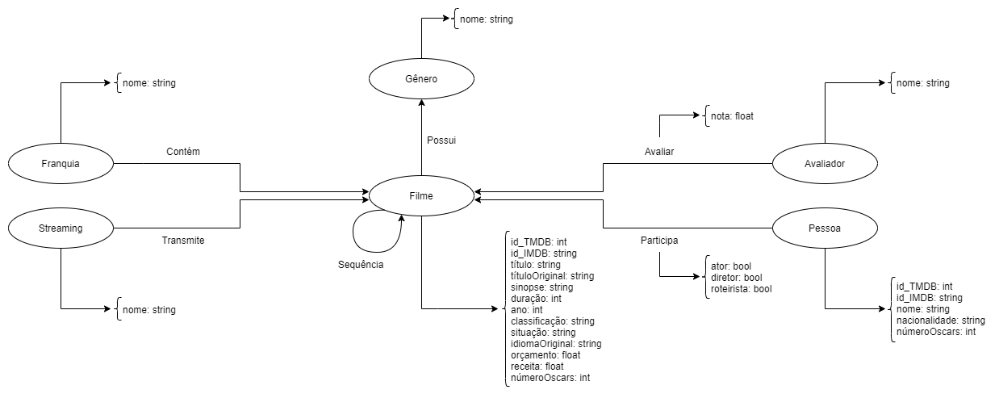
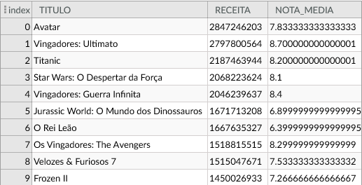
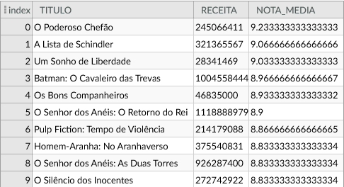
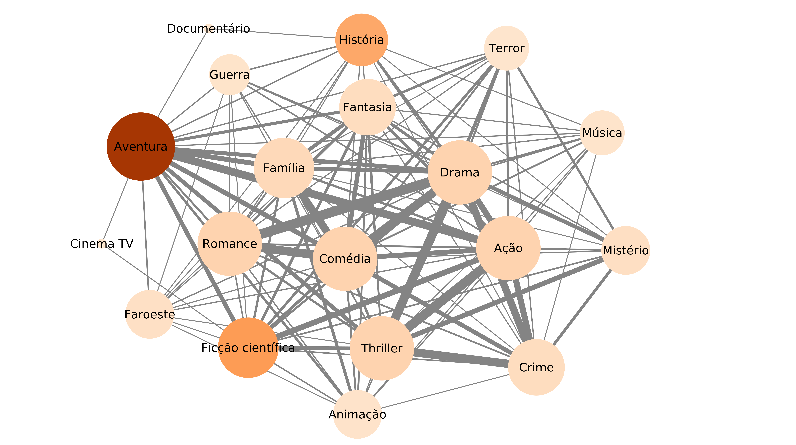
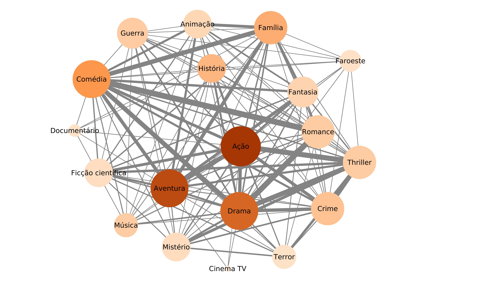
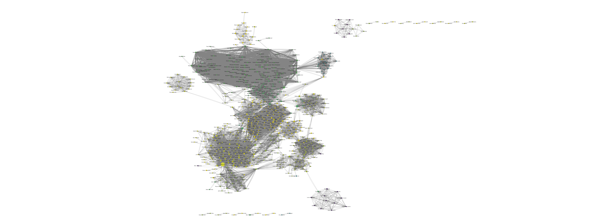

# Projeto Movie Catalog Dataset

# Equipe MovieCatalogDS - MCDS
* Maicon Gabriel de Oliveira - 221329
* Mylena Roberta dos Santos - 222687
* Jhonatan Cléto - 256444

## Resumo do Projeto

Filmes são uma das formas de entretenimento mais populares e lucrativas, logo não é por acaso que atualmente existem inúmeros serviços de streaming de vídeo tentando pegar a sua fatia em um mercado crescente. Com a grande quantidade de serviços, além da popularidade das franquias e universos cinematográficos, a escolha de quais filmes assistir ou por onde começar a acompanhar uma certa franquia de filmes tem se tornado uma tarefa difícil.

Mesmo que os serviços de streaming ofereçam features de recomendações de filmes baseadas nos gostos do usuário, elas são disponíveis apenas para os assinantes das plataformas e limitadas ao catálogo da plataforma.

Segundo o IMDB, a média de filmes produzidos por ano é de 2577. Empresas cinematográficas estão explorando maneiras de aumentar seu faturamento bruto de bilheteria. É difícil saber o que o público gosta antes de realmente ver suas críticas. Muitos fatores podem influenciar o gosto do público e a bilheteria bruta de um filme, como diretor, elenco, gênero e orçamento. Assim, encontrar as características que fazem um filme ter sucesso, pode ajudar as produtoras a ajustar seu planejamento, melhorando o lucro e diminuindo os riscos com a produção. 

Nesse contexto o Movie Catalog Dataset, objetiva-se a ser uma base de dados sobre a indústria cinematográfica, permitindo a construção de mecanismos de busca e análise a respeito de diversos aspectos relacionados aos cinema. Sendo que alguns deles são: gêneros, pessoas que participaram de filmes (diretores, roteiristas e atores) e os filmes por si só.

## Slides da Apresentação

[Slides](./slides/apresentacao-final.pdf)

## Modelo Conceitual

## Modelos Lógicos

Modelo Lógico Relacional

~~~
FILME(_id_TMDB_, id_IMDB, titulo, titulo_original, sinopse, duracao, ano, classificacao, situacao, idioma_original, orcamento, receita, num_oscars)
AVALIADOR(_id_, nome)
AVALIACAO(_id_avaliador_, _id_filme_TMDB_, nota)
  id_avaliador chave estrangeira -> AVALIADOR(id)
  id_filme_TMDB chave estrangeira -> FILME(id_TMDB)
FRANQUIA(_nome_)
FRANQUIAFILME(_nome_franquia_, _id_filme_TMDB_)
  nome_franquia chave estrangeira -> FRANQUIA(nome)
  id_filme_TMDB chave estrangeira -> FILME(id_TMDB)
GENERO(nome)
GENEROFILME(_nome_genero_, _id_filme_TMDB_)
  nome_genero chave estrangeira -> GENERO(nome)
  id_filme_TMDB chave estrangeira -> FILME(id_TMDB)
PESSOA(_id_TMDB_, id_IMDB, nome, nacionalidade, num_oscars)
PESSOAFILME(_id_pessoa_TMDB_, _id_filme_TMDB_, ator, diretor, roteirista)
  id_pessoa_TMDB chave estrangeira -> PESSOA(id_TMDB)
  id_filme_TMDB chave estrangeira -> FILME(id_TMDB)
SEQUENCIA(_id_filme_TMDB_, _id_filme_sequencia_TMDB_)
  id_filme_TMDB chave estrangeira -> FILME(id_TMDB)
  id_filme_sequencia_TMDB chave estrangeira -> FILME(id_TMDB)
STREAMING(_nome_)
STREAMINGFILME(_nome_streaming_, _id_filme_TMDB)
  nome_streaming chave estrangeira -> STREAMING(nome)
  id_filme_TMDB chave estrangeira -> FILME(id_TMDB)
~~~

Modelo Lógico de Grafos - Grafo de Propriedades

## Dataset Publicado

título do arquivo/base | link | breve descrição
----- | ----- | -----
Filme | [Filme.csv](./data/processed/Filme.csv) | Tabela com dados dos filmes
Sequencia | [Sequencia.csv](./data/processed/Sequencia.csv) | Relação de sequência entre filmes
Franquia | [Franquia.csv](./data/processed/Franquia.csv) | Lista das franquias que contêm os filmes na tabela Filme
FranquiaFilme | [FranquiaFilme.csv](./data/processed/FranquiaFilme.csv) | Relaciona franquias com seus respectivos filmes
Genero | [Genero.csv](./data/processed/Genero.csv) | Lista de gêneros obtidos no TMDB
GeneroFilme | [GeneroFilme.csv](./data/processed/GeneroFilme.csv) | Cada linha na tabela relaciona um filme com um gênero que ele possui
Pessoa | [Pessoa.csv](./data/processed/Pessoa.csv) | Tabela com dados sobre pessoas que participaram da produção de filmes da tabela Filme
PessoaFilme | [PessoaFilme.csv](./data/processed/PessoaFilme.csv) | Relaciona pessoas e filmes indicando o tipo de participação da pessoa: Ator, Diretor ou Roterista
Avaliador | [Avaliador.csv](./data/processed/Avaliador.csv) | Lista com alguns portais de avaliação de filmes
Avaliacao | [Avaliacao.csv](./data/processed/Avaliacao.csv) | Armazena as avaliações dos filmes da tabela Filme realizadas pelos avaliadores da tabela Avaliador
Streaming | [Streaming.csv](./data/processed/Streaming.csv) | Lista de plataformas de streaming de filmes obtidas no TMDB
StreamingFilme | [StreamingFilme.csv](./data/processed/StreamingFilme.csv) | Cada linha da tabela relaciona um filme com uma plataforma na qual ele pode ser assistido

## Bases de Dados

título da base | link | breve descrição
----- | ----- | -----
The Movie Database (TMDB) | [TMDB](https://www.themoviedb.org/?language=pt-BR) |  Base de dados gratuita e de código aberto sobre filmes e séries de TV
Internet Movie Database (IMDb) | [IMDb](https://www.imdb.com) |  Base de dados online de informação sobre cinema, TV, música e games
Rotten Tomatoes movies and critic reviews dataset | [Kaggle](https://www.kaggle.com/stefanoleone992/rotten-tomatoes-movies-and-critic-reviews-dataset/activity) |  Dataset com avaliações de filmes obtidas do Rotten Tomatoes

## Detalhamento do Projeto

#### Descrição do Processo de Coleta de Dados

O Movie Catalog Dataset (MCDS) é uma base de dados que agrega informações sobre diversas entidades no contexto da indústria cinematográfica. O coração do nosso dataset é a tabela **Filme**, sendo que cada linha dela armazena informações sobre um determinado filme. A maioria das outras tabelas que compõem o MCDS dependem de **Filme** para serem construídas. 

Com isso, um dos cuidados iniciais na elaboração do dataset foi o de elencar uma fonte de dados de filmes que fornecesse a maioria das informações que precisamos, como visto no modelo conceitual. Dentre as encontradas, o The Movie Database (TMDB) e o Internet Movie Database (IMDb) foram as fontes de dados mais interessantes. Ambas possuem APIs públicas, o que facilita a aquisição de dados.

Optamos por utilizar o TMDB como fonte principal, pois o uso de sua API não apresenta restrições no número de requisições diárias, enquanto a API do IMDb impõe um limite de 100 requisições por dia. Nosso plano inicial era ter uma base de dados com pelo menos 1000 filmes, uma quantidade de dados que acreditamos ser razoável para posteriores análises. Desse modo, o limite de requisições do IMDb tornava inviável o uso de sua API como fonte principal, dado o prazo para a entrega do dataset.

Escolhida a fonte de dados principal, escolhemos Python como a linguagem de programação para elaborar os scripts que constroem o dataset. A escolha partiu da familiaridade de todos os membros da equipe com a linguagem, além do fato dela possuir bibliotecas e frameworks para tratamento de dados que facilitam a construção do MCDS, também encontramos uma biblioteca de terceiros que torna o uso da API do TMDB mais prático.

Nem todas as informações que necessitamos estão disponíveis no TMDB, por exemplo o número de Oscars que um filme ou uma pessoa ganhou não estão presentes nessa base. Com isso, decidimos utilizar o IMDb como fonte complementar para obter os dados faltantes, pois o TMDB fornece o *id* dos filmes do IMDb como uma das informações. Dada a restrição da API do IMDb, optamos por utilizar uma biblioteca de Python - IMDbPY - que obtém dados do IMDb através de web scraping. O uso da IMDbPY foi limitado à coleta de informações sobre a classificação indicativa dos filmes e o número de Oscars recebidos por um filme ou pessoa. No entanto, a coleta de dados nessa abordagem é lenta se comparada ao uso de APIs.

Para obter as informações dos filmes no TMDB, precisamos primeiro consultar o recurso Discover da API, no qual era possível obter listas de filmes ordenados por alguma caracterista como, popularidade, data de lançamento e receita. Nessa etapa, optamos por obter filmes ordenados de maneira decrescente pelas suas receitas. As listas de filmes no Discover são distibuidas em páginas, com cerca de 20 filmes cada, assim, para obter informações preliminares sobre N filmes, são necessárias aproximadamente N/20 páginas do Discover, ou seja, N/20 requisições a API. Em seguida, utilizamos o recurso Movie da API para obter todas as informações disponíveis no TMDB sobre os filmes em cada página.

Trecho de código utilizado para obter as informações sobre filmes:

~~~python
# Retorna um dicionário com todos os detalhes que a api do TMDB fornece
def get_movie_details(movie):
  movie_tools = tmdb.Movie()
  id = movie['id']
  return movie_tools.details(id)

# Retorna uma lista com os filmes em uma página do TMDB
# Cada página costuma ter 20 filmes
def get_movies_in_page(page, sort_by:str):
  discover = tmdb.Discover()
  movie_list = discover.discover_movies({
      'primary_release_date.gte': '1900-01-01',
      'primary_release_date.lte': '2021-12-31',
      'sort_by': sort_by, # ordenamos por receitas de modo decrescente
      'page': page
  })
  return list(map(get_movie_details, movie_list))
~~~

O recurso Movie da biblioteca para a API do TMDB retorna os dados em uma estrutura semelhante a um dicionário Python, em que as chaves dos dicionários são os nomes dos dados disponíveis na API para filmes, caso o TMDB não tenha algum dos dados o valor relacionado a chave desse dado é definido como `None`. Para obter os dados que precisávamos, criamos duas listas de mesmo tamanho, uma contendo o nome dos dados que necessitávamos e outra com o nome desses dados na nossa tabela. Assim, depois de obter os dados dos filmes, construímos a tabela fazendo match por posição nas listas de chaves e então extraindo o respectivo dado pela chave na estrutura retornada pelo TMDB.

Trecho do código com a definição dos dados de filmes que coletamos do TMDB:

~~~python
# Informações Necessárias para a Tabela / Colunas da Tabela
atributos = ["id_TMDB", "id_IMDB", "titulo", "titulo_original", "sinopse", "duracao", 
             "ano", "situacao", "idioma_original",
             "orcamento", "receita"]

# Campos com as informações no objeto do filme do TMDB
atributos_tmdb = ["id", "imdb_id", "title", "original_title", "overview", "runtime",
                  "release_date", "status", "original_language",
                  "budget", "revenue"]
~~~

Após a construção da primeira versão do MCDS notamos algumas inconsistências nas tabelas **FranquiaFilme** e **Sequencia**. Nessa tabelas. alguns registros apresentavam informações incorretas, por exemplo, na tabela **FranquiaFilme**, constava que os filmes do Capitão América, da Marvel, pertencia a franquia de filmes Frozen da Disney.

Uma das formas que utilizamos para determinar a franquia em que um filme estava inserido se baseava em uma lista de franquias obtida por web scraping de uma página da Wikipedia. O filme era dito pertencente a franquia se alguma de suas keywords - dado disponível no TMDB - correpondia ao nome de alguma franquia na lista do Wikipedia. 

Descobrimos que associações indevidadas de franquias aconteciam porque alguns filmes possuem keywords com o mesmo nome de algumas franquias na lista, mesmo não pertencendo a elas. Assim, construímos um novo algoritmo para construção de franquias que selecionava uma franquia na lista e então buscava uma correspondência com o banco de keywords do TMDB. Logo, utilizando o recurso de keywords da API, obtivemos os filmes que estavam ligados a aquela franquia.

Ainda para evitar inconsistências, reduzimos o número de franquias na lista para as que sabíamos que resultaram em correspondências corretas já que seus nomes não eram comuns a assuntos abordados em filmes de modo geral.

Exemplo de código que procura por keywords no TMDB:

~~~python
def tmdb_search_keyword(api_key:str, query:str, page=1):
  
  # Constroi a url para consultar uma keyword na API do TMDB
  template = 'https://api.themoviedb.org/3/search/keyword?api_key={}&query={}&page={}'
  query = query.replace(' ', '%20')
  url = template.format(api_key, query, page)
  response = requests.get(url).json() # requisição para a API

  # caso a palavra chave não exista no TMDB
  if not check_result(response):
      return None

  # Retorna o ID da palavra chave no TMDB
  return response['results'][0]['id']

# Exemplo de consulta por keyword
keyword_id = tmdb_search(api_key, 'MonsterVerse')
~~~

Elaboramos também um novo algoritmo que encontra as sequências, removendo a necessidade de fazer consultas a API do TMDB, pois o nosso próprio dataset possuia as informações necessárias para a construção dessa tabela (**FranquiaFilme**), otimizando o tempo necessário para a construção do MCDS.

Durante a coleta de dados, notamos que o tempo para a construção de algumas tabelas era consideravelmente alto. Assim, dada a nossa expectativa inicial de 1000 filmes, a demora na construção das tabelas seria um grande entrave para o avanço do trabalho. Dessa forma, decidimos paralelizar os scripts de construção das tabelas que consideramos mais problemáticas (tabelas que necessitavam de informações do IMDbPY).

Para tanto, utilizamos a biblioteca padrão do Python, Multiprocessing, que oferece a possibilidade de iniciar processos independentes partindo de um processo pai. Com isso, a nossa paralelização consistiu em dividir o trabalho de aquisição de dados para a construção de uma tabela entre um número de processos equivalente ao número de núcleos lógicos que os nossos computadores possuem. Por exemplo, para uma máquina com 12 núcleos, são gerados 12 processos que obtêm dados de 12 filmes distintos ao mesmo tempo. 

Para se possa ter uma noção da situação, a construção da tabela **Filme** com 2000 registros necessitou de, aproximadamente, 2h30min para ser totalmente construída na versão dos scripts sem paralelização. Enquanto que, na versão paralelizada, esse tempo caiu para aproximadamente 30min, ou seja, conseguimos construir a mesma tabela em um tempo 5 vezes menor.

Trecho de ilustrando a paralelização realizada:

~~~python

from multiprocessing import Process, cpu_count

def main(args):
  num_pages, order_by, table_name = args
  num_pages = int(num_pages)

  num_pss = cpu_count() # Número de Treads do CPU

  # páginas por processador = ceil(num_pages/num_pss)
  ppp = num_pages//num_pss + 1
  pr_array = list()

  # Cria um processo para cada núcleo no computador
  # Cada processo constroi um pedaço da tabela
  for i in range(num_pss):
      t_name = f'data/{table_name}_{i}.csv'
      s_page = ppp*i + 1
      pr = Process(target=movie_job, args=(ppp, order_by, t_name, s_page, i))
      pr_array.append(pr)
      pr.start()
      print(f"ID do processo p{i}: {pr.pid}") 

  for i in range(len(pr_array)):
      pr_array[i].join()

  # Unir todos os pedaços da tabela
  concatenar((table_name, num_pss))
~~~

#### Lista/Resumo das operações realizadas

* Agregação de dados obtidos a partir da API do TMDB;
* Extração de dados páginas do IMDb via IMDbPY;
* Transformação de dados vindos do IMDb (cálculo do cúmero de Oscars);
* Exclusão de registros com dados essenciais faltantes;
* Integração de dados entre as diferentes fontes (TMDB, IMDb e Rotten Tomatoes);
* Paralelização das operações de extração de dados do IMDb.

#### Tamanho Final do Dataset

Base | Número de Registros | Tamanho
----- | ----- | -----
Filme | 5040 | 2.39 MB
Sequencia | 740 | 9.05 KB
Franquia | 809 | 11.4 KB
FranquiaFilme | 1600 | 31.8 KB
Genero | 19 | 204 B
GeneroFilme | 13522 | 204 KB
Pessoa | 92154 | 3.64 MB
PessoaFilme | 176468 | 4.97 MB
Avaliador | 3 | 65 B
Avaliacao | 13561 | 231 KB
Streaming | 418 | 4.78 KB
StreamingFilme | 35780 | 612 KB

## Evolução do Projeto

É possível descrever a evolução do projeto através dos seguintes tópicos:

* Mudança de foco: uma de nossas motivações primárias ao escolhermos o tema de filmes foi a de analisar franquias e universos cinematográficos. Todavia, conforme avançamos com o projeto, percebemos que os pontos mais interessantes para análise estavam nas relações entre os filmes e as pessoas que trabalharam neles, assim como nas relações entre os filmes e os gêneros que os classificam.

* Decisão de utilizar APIs: levando em consideração que a agregação de datasets sobre filmes disponíveis na internet poderia requerer massivos tratamentos e transformações de dados, ponderamos que talvez fosse mais eficiente obter informações por requisições a APIs das fontes de dados escolhidas (TMDB e IMDb). Essa decisão nos ajudou a dar continuidade ao projeto, visto que cada nova versão do dataset era uma expansão da versão anterior.

* Expansão da quantidade de dados do dataset: para concluirmos a versão inicial do dataset, coletamos os dados relativos a 100 filmes e, para a versão final, projetávamos coletar os dados relacionados a cerca de 1000 filmes. No entanto, conforme o projeto avançou, decidimos aumentar mais a quantidade de filmes, que passou para 2000. Por fim, ao decidirmos que um número maior de dados resultaria em melhores resultados para as perguntas/análises, segue que a versão final do dataset tem dados relativos a cerca de 5000 filmes.

* Necessidade de otimizar os scripts de extração de dados: embora a decisão de usar APIs tenha trazido consequências boas, quando fomos aumentar a quantidade de dados no dataset, nos deparamos com um problema: a grande demora para a coletar dados. Para resolvê-lo, decidimos por paralelizar trechos chave dos scripts que responsáveis por essa função. Como resultado da paralelização, nos casos mais extremos (bases de dados **Pessoa** e **Avaliador**), houve uma diminuição de mais de 90% de tempo necessário para realizar a coleta de dados.

* Adição de dados do Rotten Tomatoes (RT): com intuito de dar mais credibilidade às avaliações dos filmes presentes no dataset, decidimos considerar o RT como um outro avaliador, além do TMDB e IMDb. Inicialmente, a ideia era a de realizarmos web-scrapping em seu site, mas, devido à complexidade de suas páginas dinâmicas e APIs descontinuadas, optamos por utilizar um dataset disponível no Kaggle que contava com dados de avaliações do RT sobre filmes lançados até outubro de 2020. Sendo que todas as notas obtidas foram tratadas para que estivessem na escala 0-10, assim como foi feito com as notas obtidas das outras fontes.

## Perguntas de Pesquisa/Análise Combinadas e Respectivas Análises

### Perguntas/Análises com Resposta Implementada

#### Pergunta/Análise 1

* Os filmes que mais fizeram sucesso com o público também são aqueles que mais fizeram sucesso com a crítica?
  
  * De modo a responder à esta pergunta, foi necessário analisarmos as receitas e as avaliações de todos os filmes obtidos. Conforme o conjunto de queries SQL a seguir, a partir das bases **Filme** e **Avaliacao**, calculamos a nota média de cada um dos filmes, tomando somente aqueles julgados por todos os avaliadores considerados (TMDB, IMDb e Rotten Tomatoes), e depois geramos duas tabelas que contam com as colunas: nome do filme, receita e nota média.

    ~~~sql
    /* Relação entre sucesso com o público (receita)
    e sucesso com a crítica (nota média) dos filmes */

    DROP TABLE IF EXISTS FilmeReceitaNota;
    DROP TABLE IF EXISTS FilmeAvaliacao;

    CREATE VIEW FilmeAvaliacao AS
        SELECT A.id_filme, SUM(A.nota) nota_total, COUNT(A.id_filme) qtd_avaliacoes
            FROM Avaliacao A
            GROUP BY A.id_filme;

    CREATE VIEW FilmeReceitaNota AS
        SELECT A.id_filme, F.titulo, F.ano, F.receita, (A.nota_total / A.qtd_avaliacoes) nota_media
            FROM Filme F, FilmeAvaliacao A
            WHERE A.id_filme = F.id_TMDB
              AND qtd_avaliacoes > 2;

    -- Ordenação decrescente por receita
    SELECT titulo, receita, nota_media 
        FROM FilmeReceitaNota
        ORDER BY receita DESC LIMIT 10;

    -- Ordenação decrescente por nota média
    SELECT titulo, receita, nota_media
        FROM FilmeReceitaNota
        ORDER BY nota_media DESC LIMIT 10;
    ~~~

  * Seguem abaixo as tabelas resultantes que mostram os dez primeiros filmes levando em consideração, respectivamente, a ordenação decrescente de receitas e a ordenação decrescente de notas médias.

    

    

    * Conforme podemos observar pelos dez primeiros colocados de cada uma das tabelas, os filmes que mais agradaram o público certamente não são os mesmos que mais agradaram a crítica. Assim, é possível afirmar que o público e a crítica são dois polos distintos e, muito provavelmente, as características dos filmes que fazem sucesso com cada um deles são distintas.

#### Pergunta/Análise 2

* Como os gêneros que classificam os filmes se relacionam em uma determinada década?
  
  * Para responder à esta pergunta, foi necessário analisarmos os gêneros que os classificam os filmes contidos no dataset, restringindo os filmes em questão pela década em que foram lançados. Ademais, utilizamos o Neo4j e também o Cytoscape a fim de gerarmos as respostas desejadas.
  
    * No Neo4j, a partir das bases **Filme** e **GeneroFilme**, geramos um grafo homogêneo que relaciona os gêneros através dos filmes classificados por eles. Partindo então desse grafo, produzimos grafos homogêneos em que os gêneros estavam conectados apenas por filmes lançados em uma década específica. De modo que o peso das arestas entre dois gêneros adjacentes representa a quantidade de filmes lançados que pode ser classificado por ambos. Produzidos os grafos, geramos tabelas no formato CSV que representam as conexões entre os gêneros e também seus pesos.

    ~~~cypher
    // Grafo homogêneo da relação entre gêneros na década de 2000

    MATCH (g1:Genero)<-[a]-(f:Filme)-[b]->(g2:Genero)
    WHERE 2000 < toInteger(f.ano) <= 2010 AND g1.nome <> g2.nome
    MERGE (g1)<-[r:Cogen_2000]->(g2)
    ON CREATE SET r.num_filmes = 1
    ON MATCH SET r.num_filmes=r.num_filmes+1

    // Tabela que representa o grafo da relação entre gêneros na década de 2000

    MATCH (g1:Genero)<-[e:Cogen_2000]->(g2:Genero)
    RETURN g1.nome AS source, g2.nome AS target, e.num_filmes as weight
    ~~~
  
    * No Cytoscape, com base nos arquivos CSV gerados pelo Neo4j, construímos os grafos e aplicamos sobre eles análises de centralidade por grau e centralidade por betweenness. Sendo que, pelas configurações de visualização, definimos que a centralidade por grau é proporcional ao tamanho dos nós, a centralidade por betweenness é mostrada pela cor dos nós e a grossura de uma aresta é proporcional ao seu peso.
  
  * Seguem abaixo as figuras que ilustram os grafos homogêneos que representam as relações entre os gêneros dos filmes lançados nas décadas de 1990 e 2000, respectivamente.

    

    

    * Analisando os grafos, podemos observar que as relações entre os gêneros muda drasticamente de uma década para a outra. Por exemplo, em 1990, Aventura é gênero que mais relevante e a combinação entre Drama e Romance é uma das mais recorrentes. Em 2000, por sua vez, Ação é o gênero de destaque e a combinação de Comédia e Romance é uma das mais comuns.

#### Pergunta/Análise 3

* Quais são as comunidades de pessoas que podem ser mapeadas? E quais são as pessoas mais relevantes dentre elas?
  
  * De modo a responder à esta pergunta, foi necessário analisarmos todas as pessoas (atores, diretores e roteiristas) que participaram dos filmes obtidos. Ademais, utilizamos o Neo4j e também o Cytoscape a fim de gerarmos as respostas desejadas.
  
    * No Neo4j, a partir das bases **Filme** e **PessoaFilme**, geramos um grafo homogêneo que relaciona pessoas através dos filmes em que elas colaboraram. De modo que o peso das arestas entre duas pessoas adjacentes representa a quantidade de filmes em que ambas trabalharam juntas. Em seguida, aplicamos sobre esse grafo análises de PageRank e também de comunidade. Feitas as análises, geramos uma tabela no formato CSV que representa as conexões entre as pessoas e também seus pesos.

    ~~~cypher
    // Cálculo dos scores do PageRank no grafo

    CALL gds.graph.create(
      'prGraph',
      'Pessoa',
      'Coparticipa'
    )

    CALL gds.pageRank.stream('prGraph')
    YIELD nodeId, score
    MATCH (p:Pessoa {id: gds.util.asNode(nodeId).id})
    SET p.pagerank = score

    // Geração das comunidades de pessoas no grafo

    CALL gds.graph.create(
      'communityGraph',
      'Pessoa',
      {
        Coparticipa: {
          orientation: 'UNDIRECTED'
        }
      }
    )

    CALL gds.louvain.stream('communityGraph')
    YIELD nodeId, communityId
    MATCH (p:Pessoa {id: gds.util.asNode(nodeId).id})
    SET p.comunidade = communityId

    // Exportando os dados para utilizar no Cytoscape (CSV)
    // Utilizamos um recorte de arestas com peso maior igual a 3

    MATCH (p1:Pessoa)-[e:Coparticipa]->(p2:Pessoa)
    WHERE e.num_filmes >= 3
    RETURN p1.nome AS source, p2.nome AS target, e.num_filmes as weight
    ORDER BY source

    MATCH (p1:Pessoa)-[e:Coparticipa]->(p2:Pessoa)
    WHERE e.num_filmes >= 3 
    RETURN DISTINCT p1.nome AS nome, p1.pagerank AS pagerank, p1.comunidade as comunidade
    ORDER BY nome
    ~~~

    * No Cytoscape, com base no arquivo CSV gerados pelo Neo4j, construímos o grafo e, pelas configurações de visualização, definimos que o score do PageRank de cada nó é proporcional ao seu tamanho e a grossura de uma aresta é proporcional ao seu peso.

  * A figura a seguir ilustra o grafo que relaciona comunidades de pessoas por completo.

      

  * Segue abaixo a figura que ilustra em destaque o recorte do grafo que representa a comunidade (cor vermelha) do universo cinematográfico da Marvel.

      

    * Na comunidade em questão, podemos observar que Stan Lee é a pessoa mais relevante, estando conectado a outras dezenas de pessoas de colaboraram juntas nos filmes deste universo.

**\* Observação:** é válido ressaltar que, devido à enorme quantidade de dados relativos a pessoas na versão final do dataset, foi necessário considerarmos as tabelas da versão inicial - 100 Filmes - para que fosse possível realizar os processamentos requeridos para a obtenção das respostas apresentadas para esta pergunta/análise.

### Perguntas/Análises Propostas mas Não Implementadas

#### Pergunta/Análise 1

* Sabendo que uma pessoa X trabalhou com uma pessoa Y no filme A e com uma pessoa Z no filme B, qual é a probabilidade das pessoas Y e Z trabalharem juntas em um filme C?
  
  * Com base em nosso dataset, pode ser gerado um grafo homogêneo que relaciona pessoas (atores, diretores e roteiristas) através filmes em que elas trabalharam juntas. Realizando um análise de predição de link sobre esse grafo, é possível calcular a probabilidade de duas pessoas colaborarem em um novo filme. Sendo que tais pessoas trabalharam com uma pessoa em comum, mas nunca colaboraram juntas. A resposta dessa pergunta pode ser relevante para facilitar o processo de casting - seleção de atores, roteiristas, etc. - de um filme em pré-produção, por exemplo.

#### Pergunta/Análise 2

* Quais são as características de um filme que faz sucesso com o público?

  * A partir de nosso dataset, utilizando queries SQL, é possível elencar os filmes com as maiores receitas, isto é, que fizeram mais sucesso com público nos cinemas. Definindo um recorte temporal que tem início em 2018, por exemplo, pode-se verificar quais foram os filmes que mais lucraram nos últimos anos, sendo possível verificar quais são seus gêneros, seu orçamento, as pessoas envolvidas em sua produção, dentre outros aspectos. Em posse dessas informações, um estúdio da indústria cinematográfica pode ser capaz de desenhar o "mapa do tesouro" do sucesso com o público e identificar quais são os requisitos para aumentar seu lucro e reconhecimento, por exemplo.

#### Pergunta/Análise 3

* Quem são as pessoas mais relevantes em cada gênero em uma determinada década?
  
  * Com base em nosso dataset, pode ser gerado um grafo homogêneo que relaciona pessoas (atores, diretores e roteiristas) através do gênero que classifica os filmes em que elas trabalharam juntas. Para delimitar a década de interesse, basta que o ano de lançamento de cada um dos filmes seja verificado na montagem do grafo. Fazendo recortes desse grafo que admitem somente pessoas que estão conectadas por um mesmo gênero, podemos aplicar uma análise de centralidade por PageRank para determinar as pessoas mais relevantes do gênero em questão. A resposta dessa pergunta pode ser relevante para o estudo da história da indústria cinematográfica, por exemplo.

Além das perguntas/análises com respostas implementadas apresentadas acima, submetemos o dataset a outras perguntas/análises no formato de queries que podem ser encontradas nos seguintes arquivos:

* Conjunto de queries SQL: [QueriesSQL.ipynb](./notebooks/QueriesSQL.ipynb)

* Conjunto de queries Cypher: [QueriesCypher.md](./src/QueriesCypher.md)