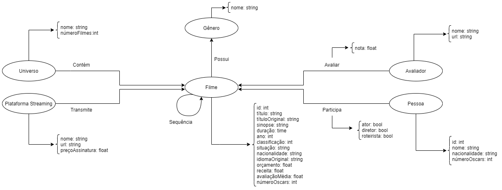

# Lab08 - Modelo Lógico e Análise de Dados em Grafos

# Equipe MovieCatalogDS - MCDS
* Maicon Gabriel de Oliveira - 221329
* Mylena Roberta dos Santos - 222687
* Jhonatan Cléto - 256444

## Modelo Lógico Combinado do Banco de Dados de Grafos

## Perguntas de Pesquisa/Análise Combinadas e Respectivas Análises

> Liste aqui as perguntas de pesquisa/análise combinadas e revisadas dos membros da equipe e respectivas análises.
>
### Pergunta/Análise 1
> * Pergunta 1
>   
>   * Explicação sucinta da análise que será feita no grafo para atender à pergunta. Deve ser indicado explicitamente em qual das modalidades a análise se encaixa: centralidade; vulnerabilidade; comunidade/modularidade; motifs; predição de links.

* Quais os filmes mais relevantes de acordo com a premiação mais importante da industria cinematografica?
    * Para responder essa questão utilizaremos uma análise de centralidade, na qual a partir das pessoas que participam de um determinado filme, iremos aumentar a relevância do filme utilizando o número de premiações que cada um desses indivíduos recebeu aliado ao número de premiações que o própio filme recebeu. (PageRank)  
    * Possíveis dados a serem utilizados:
        * Número de premiações recebidas por cada pessoa
        * Número de premiações recebidas por cada filme

### Pergunta/Análise 2
> * Pergunta 2
>   
>   * Explicação sucinta da análise que será feita no grafo para atender à pergunta. Deve ser indicado explicitamente em qual das modalidades a análise se encaixa: centralidade; vulnerabilidade; comunidade/modularidade; motifs; predição de links.

* Quais os universos cinematograficos mais rentáveis?
    * Para responder essa pergunta utilizaremos uma análise de comunidades, na qual cada universo representa uma comunidade de filmes e a partir deles iremos definir as mais rentáveis pela soma total dos lucros (receita - orçamento) dos filmes.
    * Possíveis dados a serem utilizados:
        * Receita dos filmes
        * Orçamento dos filmes

### Pergunta/Análise 3
> * Pergunta 3
>   
>   * Explicação sucinta da análise que será feita no grafo para atender à pergunta. Deve ser indicado explicitamente em qual das modalidades a análise se encaixa: centralidade; vulnerabilidade; comunidade/modularidade; motifs; predição de links.

* Quais as plataformas de Streaming com melhor custo-benefício relativo a qualidade dos filmes segundo a crítica?
    * Para responder essa pergunta desenvolveremos um sistema de pontuação para as plataformas de streaming, utilizando as avaliações dos filmes que a plataforma possui, então classificaremos as plataformas de acordo com a maiores pontuações. A análise utilizada mesclaria conceitos de comunidades para identificar filmes em um intervalo de avaliações e conceitos de centralidade para aumentar a relevância das plataformas.
    * Possíveis dados a serem utilizados:
        * Preço da assinatura das plataformas (assinatura com mais recursos)
        * Número de filmes nas plataformas
        * Avaliações dos filmes