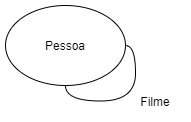

# Lab08 - Modelo Lógico e Análise de Dados em Grafos

# Equipe MovieCatalogDS - MCDS
* Maicon Gabriel de Oliveira - 221329
* Mylena Roberta dos Santos - 222687
* Jhonatan Cléto - 256444

## Modelo Lógico Combinado do Banco de Dados de Grafos

*Figura 1 - Modelo Lógico de Grafos*

  
*Figura 2 - Projeção de pessoas conectadas por filmes*

  
*Figura 3 - Projeção de gêneros conectados por filmes*

## Perguntas de Pesquisa/Análise Combinadas e Respectivas Análises

### Pergunta/Análise 1

* Sabendo que uma pessoa X trabalhou com uma pessoa Y no filme A e com uma pessoa Z no filme B, qual é a probabilidade das pessoas Y e Z trabalharem juntas em um filme C?
  * Com base na projeção de uma rede que conecta as pessoas pelos filmes em que elas trabalharam (Figura 2), calcularemos pela análise de **motifs** a probabilidade de duas pessoas trabalharam juntas em um novo filme. Sendo que tais pessoas trabalharam com uma pessoa em comum, porém nunca trabalharam em conjunto. É importante ressaltar que a quantidade de filmes em comum entre duas pessoas será tratada como o peso da aresta que as conectam.

### Pergunta/Análise 2

* Quais são as combinações de gêneros mais comuns por década?
  * Com base na projeção de uma rede que conecta os gêneros pelos filmes que se encaixam neles (Figura 3), de modo que os filmes foram filtrados por uma determinada década de lançamento, buscaremos combinações de gêneros que se destacam na rede pela análise de **comunidade/modularidade**.

### Pergunta/Análise 3

* Existe alguma relação entre a relevância das pessoas na indústria cinematográfica e quantidade de Oscars que as mesmas receberam?
  * Com base na projeção de uma rede que conecta as pessoas pelos filmes em que elas trabalharam (Figura 2), estabeleceremos a relevância das pessoas por uma análise de **centralidade por grau** e relacionaremos a quantidade de Oscars recebidos por elas com as suas relevâncias.