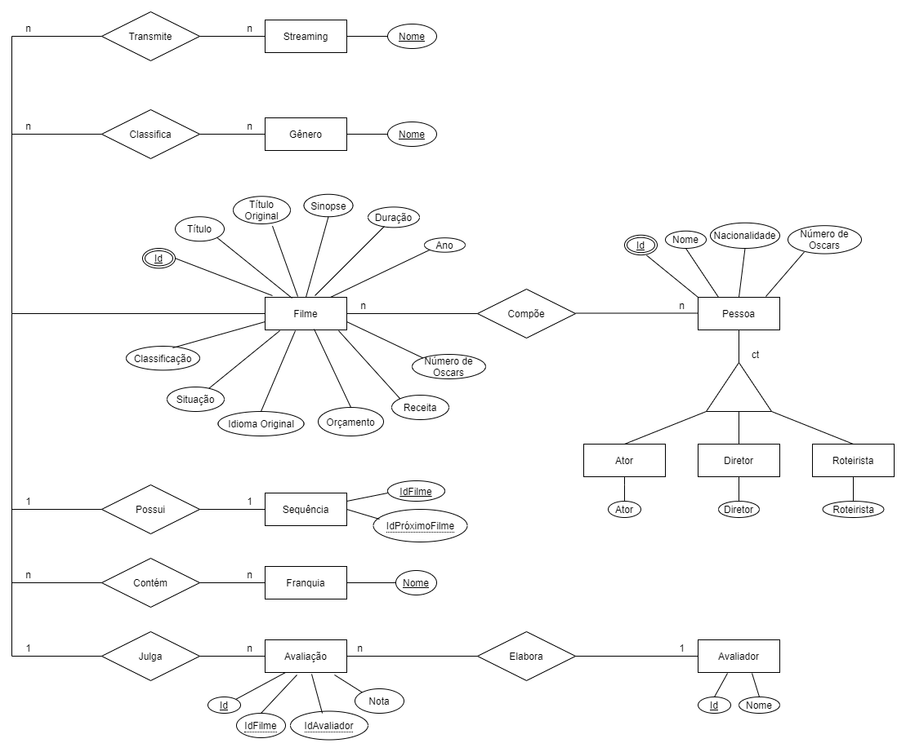
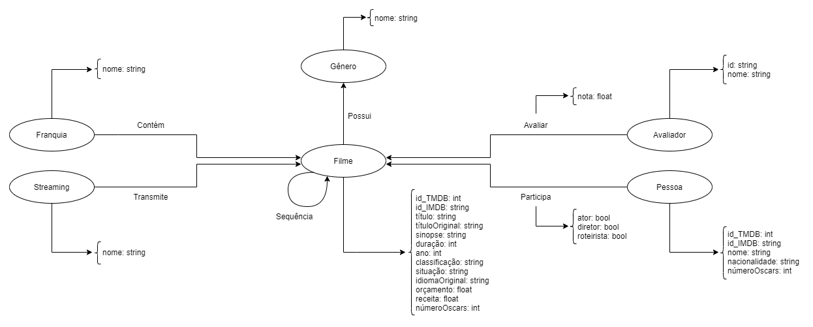

# Projeto Movie Catalog Dataset

# Equipe MovieCatalogDS - MCDS
* Maicon Gabriel de Oliveira - 221329
* Mylena Roberta dos Santos - 222687
* Jhonatan Cléto - 256444

## Resumo do Projeto
Filmes são uma das formas de entretenimento mais populares e lucrativas, não é por acaso que atualmente existam inúmeros serviços de streaming de vídeo tentando pegar a sua fatia em um mercado crescente. Com a grande quantidade de serviços, além da popularidade das franquias e universos cinematográficos, a escolha de quais filmes assistir ou por onde começar a acompanhar uma certa franquia de filmes tem se tornado uma tarefa difícil.

Mesmo que os serviços de streaming ofereçam features de recomendações de filmes baseadas nos gostos do usuário, elas são disponíveis apenas para os assinantes das plataformas e limitadas ao catálogo da plataforma.

Segundo o IMDB, a média de filmes produzidos por ano é de 2577. Empresas cinematográficas estão explorando maneiras de aumentar seu faturamento bruto de bilheteria. É difícil saber o que o público gosta antes de realmente ver suas críticas. Muitos fatores podem influenciar o gosto do público e a bilheteria bruta do filme, como diretor, elenco, gênero e orçamento. Assim, encontrar as características que fazem um filme ter sucesso, pode ajudar as produtoras a ajustar seu planejamento, melhorando o lucro e diminuindo os riscos com a produção. 

Nesse contexto o Movie Catalog Dataset, objetiva-se a ser uma base de dados sobre a indústria cinematográfica, permitindo a construção de mecanismos de busca e análise a respeito de diversos aspectos relacionados aos cinema. Sendo que alguns deles são: gêneros, pessoas que participaram de filmes (diretores, roteiristas e atores) e os filmes por si só.

## Slides da Apresentação
[Slides](slides/apresentação.pdf)

## Modelo Conceitual Preliminar

## Modelos Lógicos Preliminares

Modelo Lógico Relacional

~~~
FILME(_id_TMDB_, _id_IMDB_, titulo, titulo_original, sinopse, duracao, ano, classificacao, situacao, idioma_original, orcamento, receita, num_oscars)
AVALIADOR(_id_, nome)
AVALIACAO(_id_avaliador_, _id_filme_TMDB_, nota)
  id_avaliador chave estrangeira -> AVALIADOR(id)
  id_filme_TMDB chave estrangeira -> FILME(id_TMDB)
FRANQUIA(_nome_)
FRANQUIAFILME(_nome_franquia_, _id_filme_TMDB_)
  nome_franquia chave estrangeira -> FRANQUIA(nome)
  id_filme_TMDB chave estrangeira -> FILME(id_TMDB)
GENERO(nome)
GENEROFILME(_nome_genero_, _id_filme_TMDB_)
  nome_genero chave estrangeira -> GENERO(nome)
  id_filme_TMDB chave estrangeira -> FILME(id_TMDB)
PESSOA(_id_TMDB_, _id_IMDB_, nome, nacionalidade, num_oscars)
PESSOAFILME(_id_pessoa_TMDB_, _id_filme_TMDB_, ator, diretor, roteirista)
  id_pessoa_TMDB chave estrangeira -> PESSOA(id_TMDB)
  id_filme_TMDB chave estrangeira -> FILME(id_TMDB)
SEQUENCIA(_id_filme_TMDB_, _id_filme_sequencia_TMDB_)
  id_filme_TMDB chave estrangeira -> FILME(id_TMDB)
  id_filme_sequencia_TMDB chave estrangeira -> FILME(id_TMDB)
STREAMING(_nome_)
STREAMINGFILME(_nome_streaming_, _id_filme_TMDB)
  nome_streaming chave estrangeira -> STREAMING(nome)
  id_filme_TMDB chave estrangeira -> FILME(id_TMDB)
~~~

Modelo Lógico de Grafos

